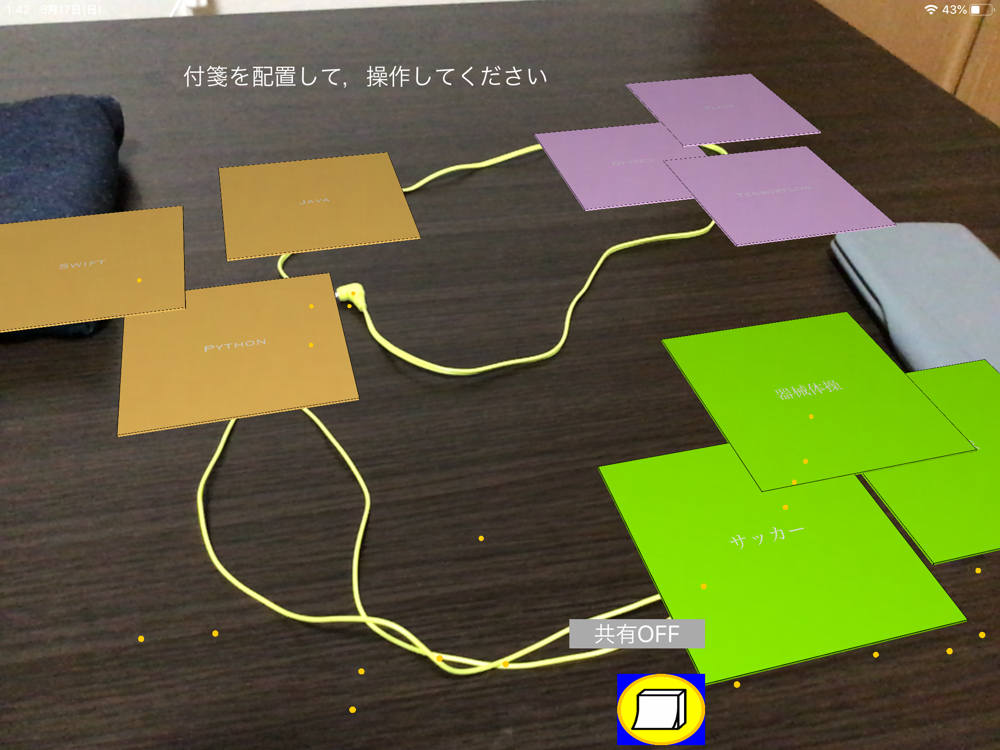

## 拡張現実空間上で行うAR付箋共有システム
### 概要
AR付箋の作成及びAR空間への配置，付箋の操作が行える．

P2P通信とARKit2.0により多人数での空間共有を可能としている．

ただし，空間共有時の付箋操作開発中のための座標変換処理が不完全．
##### 上からの様子

##### 横からの様子

### 実行環境
ARKitが使用できるiOS端末(iphoneだと6s以降)

### インターフェース例

左画面：AR付箋作成画面 
(A:付箋名の入力，B:付箋の色の選択，C:作成した付箋のイメージ，D:押すことでARオブジェクトとして作成可能)

右画面：3つのAR付箋を配置したAR空間の様子．選択及びドラッグで付箋が操作可能．

### 端末間通信(multipeerSession.swift)  
multipeerConnectivityを使って，p2p通信を行なっている  

### 各ファイル
#### viewController.swift  
端末間通信以外の全ての処理をここに書いてる

関数は別で管理した方が見やすいので，時間があれば分けて管理する予定

アプリ起動後，平面検出時に平面上に原点を置く処理を行っていた．
しかし，原点設置後に画面遷移を行うと原点が勝手に移動してしまうというエラーが発生.
ARKit2.0にバージョンアップした途端，エラーが解消(画面遷移の処理が一部更新されたから，かも)

#### MakeHusenController.swift

AR付箋の作成．viewController.swiftとはpresent/promissで行き来している．

